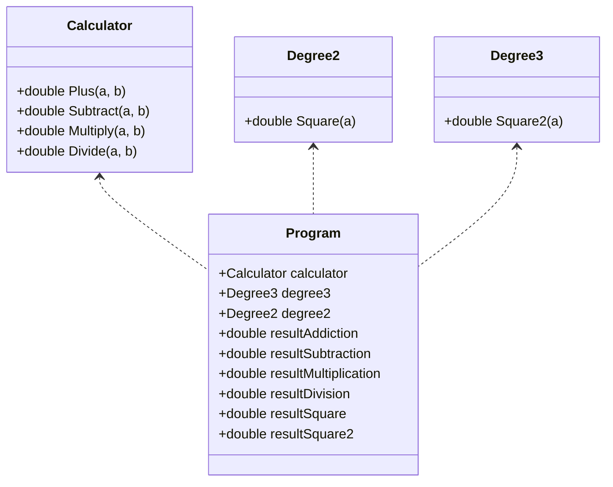

```mermaid
classDiagram
class Program{
    +Calculator calculator
    +Degree3 degree3
    +Degree2 degree2
    +double resultAddiction
    +double resultSubtraction
    +double resultMultiplication
    +double resultDivision
    +double resultSquare
    +double resultSquare2
}
class Calculator{
    +double Plus(a, b)
    +double Subtract(a, b)
    +double Multiply(a, b)
    +double Divide(a, b)
}
class Degree2{
    +double Square(a)
}
class Degree3{
    +double Square2(a)
}
Calculator <.. Program
Degree2 <.. Program
Degree3 <.. Program
```
